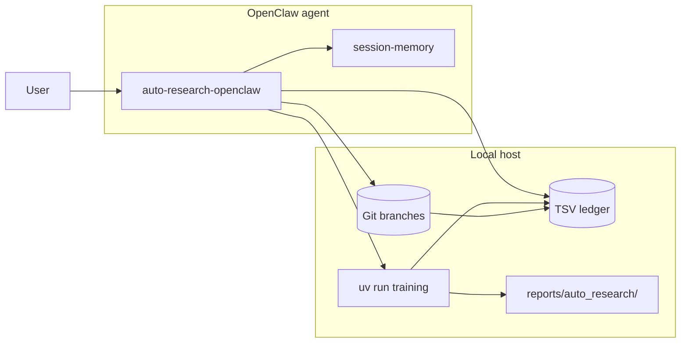
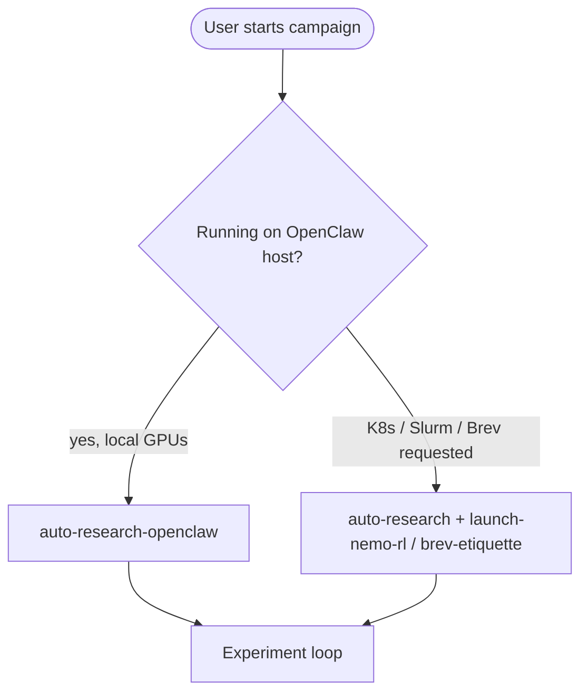
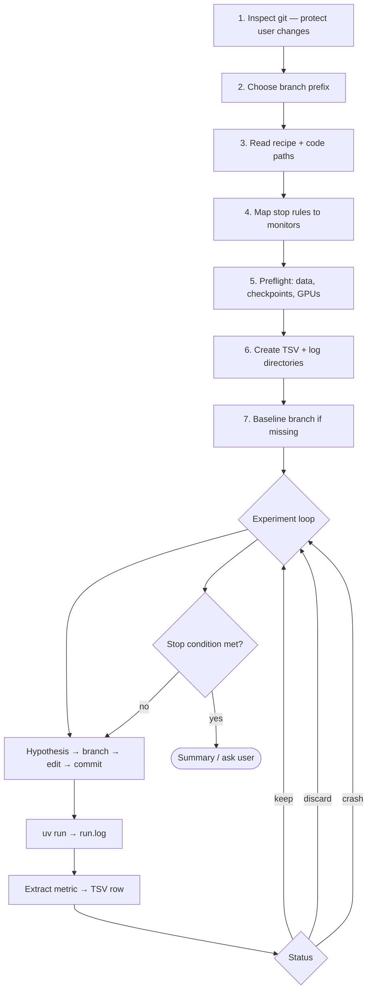
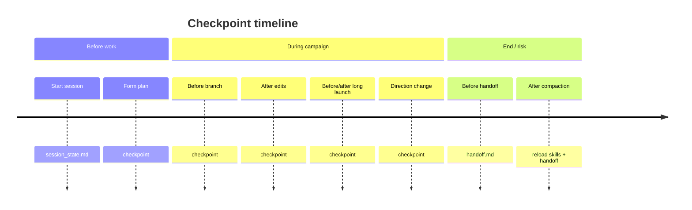
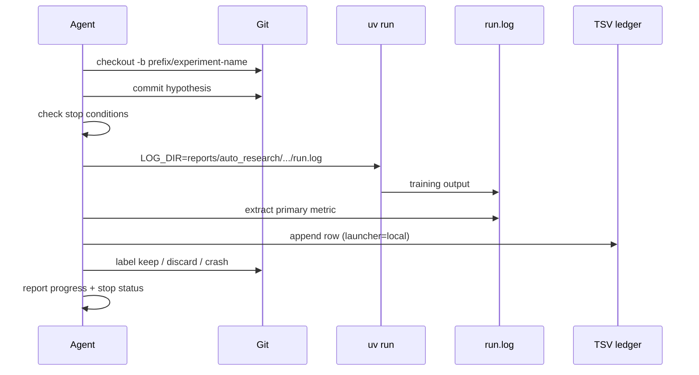
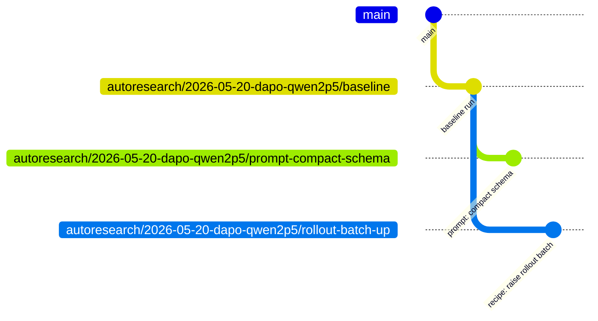
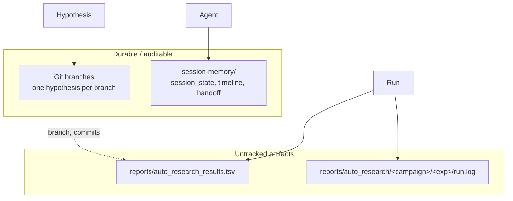
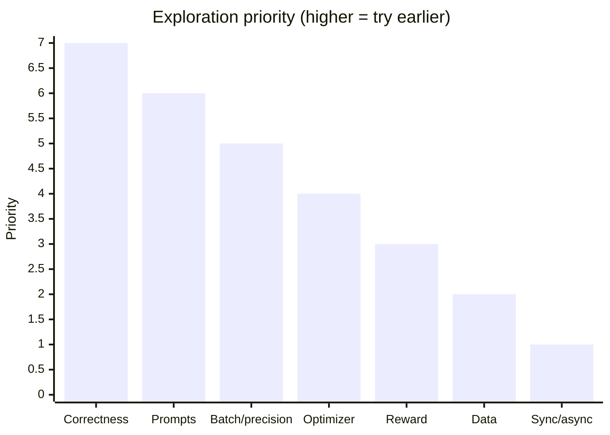
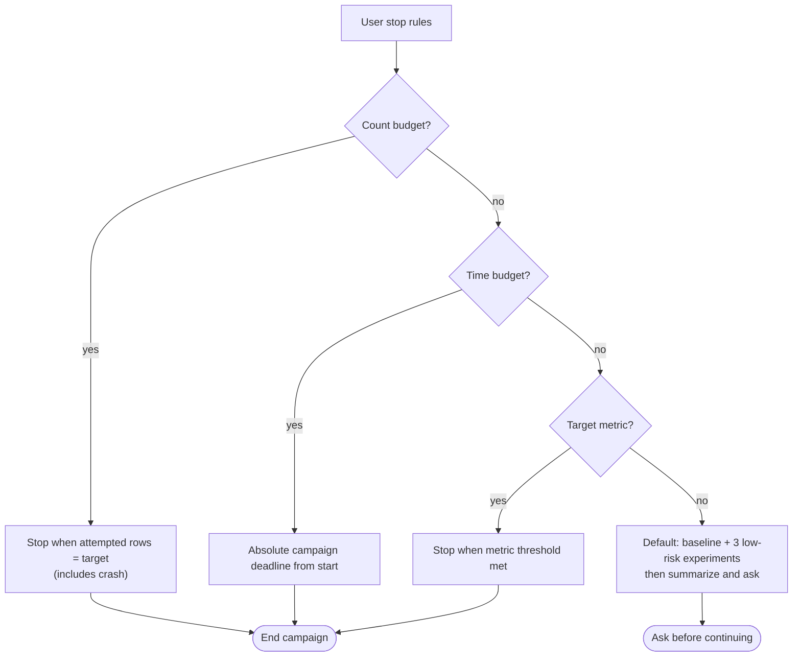

# Auto Research (OpenClaw)

Autonomous NeMo-RL research playbook for **OpenClaw** agents running on a **local machine** with GPUs. The agent iterates on recipe configs and code, records results in an **untracked TSV ledger**, and uses **git branches** as the experiment journal.

| | |
|---|---|
| **Skill name** | `auto-research-openclaw` |
| **Requires** | `uv`, `git` (host binaries) |
| **Companion skill** | [`session-memory`](../session-memory/SKILL.md) |
| **Base playbook** | [`auto-research`](../auto-research/SKILL.md) (same loop; different default runtime) |
| **Agent entrypoint** | [`SKILL.md`](SKILL.md) |

---

## What this skill does

When an OpenClaw agent is asked to tune a recipe, improve a metric, or run a long local GPU campaign, this skill defines:

1. **How** to read recipes and NeMo-RL code paths.
2. **Where** to run training (`uv run` on the host checkout).
3. **How** to branch, commit, log, and label each hypothesis.
4. **When** to stop (explicit user budgets only).

It is **not** executable Python—it is instructions for the agent. Training still runs via normal NeMo-RL entrypoints (for example `./examples/run_grpo.py --config ...`).



---

## OpenClaw vs generic auto-research

| Aspect | `auto-research` | `auto-research-openclaw` |
|--------|-----------------|---------------------------|
| Default runtime | Local, K8s, Slurm, Brev (user/environment driven) | **Local host only** |
| TSV `launcher` | `local`, cluster ids, etc. | `local` |
| TSV `job_id` | Slurm / Ray / K8s id when applicable | `none` |
| Long jobs | Environment-specific | **Background exec** + poll `run.log` |
| Remote paths | Brev `/ephemeral`, etc. | User caches (`~/.cache/...`) |
| If user wants cluster | Use `launch-nemo-rl`, native Slurm, etc. | **Stop** this skill; switch to `auto-research` |



---

## Installation on OpenClaw

Pick one method, then start a new session (`/new`) or restart the gateway.

| Method | Action |
|--------|--------|
| **extraDirs** | Add NeMo-RL `skills/` (or this folder) to `skills.load.extraDirs` in `openclaw.json` |
| **Workspace copy** | `cp -R <nemo-rl>/skills/auto-research-openclaw ~/.openclaw/workspace/skills/` |
| **Project agents** | Place under `<workspace>/.agents/skills/auto-research-openclaw/` |

Verify:

```bash
openclaw skills list | grep auto-research-openclaw
```

Also enable **`session-memory`** from the same `skills/` tree.

Preflight before GPU campaigns:

```bash
git rev-parse --show-toplevel
uv --version
nvidia-smi    # when GPU training is expected
df -h .
```

See [references/openclaw-environment.md](references/openclaw-environment.md) for caches, `.env`, and background jobs.

### Azure AI Foundry (gpt-5.3-codex)

Foundry **Responses** endpoints require `type: "message"` on `input[]` items; OpenClaw sends `{role, content}` only. **Chat Completions** is unsupported for Codex on typical project `/openai/v1` URLs.

Run the skill proxy, then point `baseUrl` at `http://127.0.0.1:2929`:

```bash
export AZURE_FOUNDRY_TARGET_BASE_URL='https://<resource>.services.ai.azure.com/api/projects/<project>/openai/v1'
node skills/auto-research-openclaw/scripts/azure-foundry-responses-proxy.js
```

Details: [references/azure-foundry-openclaw.md](references/azure-foundry-openclaw.md).

---

## Campaign workflow



### Setup checklist

| Step | Action |
|------|--------|
| 1 | `git status` — note unrelated user edits; do not stash/reset silently |
| 2 | Prefix e.g. `autoresearch/2026-05-20-dapo-qwen2p5` |
| 3 | Read recipe YAML, parents, `examples/run_grpo.py`, `nemo_rl/*`, `docs/`; NeMo-gym → `examples/nemo_gym/` |
| 4 | Monitorables: `target_experiment_count`, `campaign_deadline`, `per_experiment_timeout`, `target_metric` |
| 5 | Confirm data, checkpoints, `nvidia-smi` |
| 6 | Untracked TSV + `reports/auto_research/<campaign>/` |
| 7 | `<prefix>/baseline` if no baseline yet |

### `session-memory` checkpoints



---

## Experiment loop (one hypothesis)



Launch pattern:

```bash
cd "$(git rev-parse --show-toplevel)"
LOG_DIR=reports/auto_research/<campaign>/<experiment>
mkdir -p "$LOG_DIR"
uv run <entrypoint> > "$LOG_DIR/run.log" 2>&1
```

For multi-hour training: run in **background**, record PID/start in `session-memory`, poll with `tail -n 50 "$LOG_DIR/run.log"` between chat turns.

---

## Git branch layout

One shared prefix; one branch per experiment; **never delete** experiment branches unless the user asks.

```
autoresearch/2026-05-20-dapo-qwen2p5/
├── baseline
├── prompt-compact-schema      → keep
├── rollout-batch-up           → discard
└── async-actor-split          → crash
```



### Branch outcome labels

| Status | When to use |
|--------|-------------|
| **keep** | Metric improved, or simpler code with flat metric, or unlocks a strong follow-up |
| **discard** | Regression, instability without upside, or complexity with no benefit |
| **crash** | No valid metric (OOM, backend failure, timeout, etc.) |

Parent commit choice:

| Parent | Use when |
|--------|----------|
| **baseline** | Clean A/B vs unmodified recipe |
| **best `keep`** | Building on a proven gain |
| **discarded branch** | Only to continue that exact line of inquiry |

Details: [references/git-workflow.md](references/git-workflow.md).

---

## Dual ledger architecture



| Store | Typical path | Role |
|-------|----------------|------|
| Git | `autoresearch/<date>-<slug>/<experiment>` | Reproducible config/code per idea |
| TSV | `reports/auto_research_results.tsv` | Metrics, timing, commands, status |
| Logs | `reports/auto_research/<campaign>/<experiment>/` | Full `run.log`, scripts |
| Session | `session/<timestamp>/` | Agent continuity across disconnects |

---

## TSV ledger schema

Tab-separated; header row required. OpenClaw default: `launcher=local`, `job_id=none`.

| Column | Description |
|--------|-------------|
| `index` | Attempted experiment count (for count-based stops) |
| `branch` | Full branch name under shared prefix |
| `parent_commit` | Comparison base |
| `commit` | Hypothesis commit SHA |
| `recipe` | Config path |
| `metric_name` | Authoritative validation/task metric |
| `metric_value` | Parsed value (`0.000000` on crash if unknown) |
| `memory_gb` | Auxiliary resource signal |
| `elapsed_min` | Wall-clock minutes |
| `launcher` | `local` for OpenClaw default |
| `job_id` | `none` locally; cluster id if moved off-host |
| `command` | Exact `uv run ...` or script path |
| `log_path` | Path to `run.log` or run directory |
| `status` | `keep` \| `discard` \| `crash` |
| `description` | Short hypothesis note |

Example row:

```tsv
2	autoresearch/2026-05-20-dapo-qwen2p5/prompt-compact-schema	abc1234	def5678	examples/configs/recipes/llm/dapo-qwen2.5-0.5b.yaml	val_accuracy	0.742100	43.9	58.7	local	none	uv run ./examples/run_grpo.py --config ...	reports/auto_research/.../run.log	keep	compact answer schema
```

Full template: [references/experiment-log-template.md](references/experiment-log-template.md).

---

## Hypothesis priorities

Prefer **high expected gain** and **low complexity**. Order of exploration:



| Priority | Area | Example ideas |
|----------|------|----------------|
| 1 | Correctness / backend | Fix train vs generation mismatch; DTensor vs Megatron |
| 2 | Prompt / rollout format | Compact schema, delimiters, `max_new_tokens` alignment |
| 3 | Batch, sequence, precision | Microbatch, packing, bf16 vs fp16 |
| 4 | Optimizer / scheduler | LR retune after batch changes |
| 5 | Reward / data | Scaling, clipping, validation split |
| 6 | Dataset mix | Target behavior coverage |
| 7 | Sync vs async | By **local** GPU count (1 GPU → prompts first; 8+ → actor/learner split) |

Symptom → hypothesis map: [references/exploration-ideas.md](references/exploration-ideas.md).

### Bottleneck quick reference

| Symptom | Likely focus |
|---------|----------------|
| Low accuracy, stable training | Prompt, reward, data, generation |
| NaNs / unstable loss | Precision, optimizer, sequence length, backend |
| Low GPU utilization | Batching, backend, async actor/learner |
| Good train, weak val | Prompt/evaluator mismatch, reward, validation data |

---

## Stop conditions



| Rule type | Behavior |
|-----------|----------|
| **Count** | `50 experiments` → stop at 50 **attempted** TSV rows, not 50 successes |
| **Per-run time** | Enforce recipe timeout or external `timeout` (tighter wins) |
| **Campaign time** | e.g. `10h total, 1h each` — stop when deadline hit or insufficient time for another run |
| **Combined** | Monitor all; stop when **any** campaign-level trigger is clearly met |
| **No user rules** | Baseline + up to 3 low-risk experiments → summarize → ask |

Do **not** stop because the search “feels done.”

---

## Progress reporting

Each user-facing update should include:

| Field | Example |
|-------|---------|
| Campaign prefix | `autoresearch/2026-05-20-dapo-qwen2p5` |
| Current branch | `.../prompt-compact-schema` |
| Latest metric | `val_accuracy=0.742` or `crash` |
| Attempted count | `17 / 24` |
| Remaining time | `6h12m` |
| Stop status | `not yet met` or `met: 24/24 attempted` |

Before handoff or compaction risk, update `session-memory` **`handoff.md`** with objective, stop rules, prefix, last TSV index, best `keep` branch, and latest `run.log` path.

---

## What to avoid

| Don't | Do instead |
|-------|------------|
| Default to Brev, K8s, Slurm on OpenClaw | Local `uv run`; switch skills if user moves off-host |
| `discard` from smoke runs (tiny batch, few steps) | Scale to representative settings first |
| Stash/reset unrelated user changes | Stage only experiment files; use `git worktree` |
| Lose campaign goal after compaction | Reload skills + `session-memory` handoff |

---

## Directory layout

```
skills/auto-research-openclaw/
├── SKILL.md                          # Agent instructions (OpenClaw entry)
├── README.md                         # This document
├── scripts/
│   ├── azure-foundry-responses-proxy.js   # Wraps Foundry Responses input[] for OpenClaw
│   ├── azure-foundry-proxy.env.example    # Env template (no secrets)
│   └── test-wrap-foundry-input.mjs        # Local wrap logic self-test
└── references/
    ├── openclaw-environment.md       # Host, caches, background runs
    ├── azure-foundry-openclaw.md     # Foundry Codex + OpenClaw proxy setup
    ├── git-workflow.md               # Branches, baseline, dirty worktree
    ├── exploration-ideas.md          # Symptom → hypothesis catalog
    └── experiment-log-template.md    # TSV schema and examples
```

---

## Related skills

| Skill | Role |
|-------|------|
| [`auto-research`](../auto-research/SKILL.md) | Full playbook including remote launchers |
| [`session-memory`](../session-memory/SKILL.md) | Durable checkpoints and handoff across sessions |
| `launch-nemo-rl` | When user explicitly wants Kubernetes |
| `brev-etiquette` | When user explicitly moves to Brev |

---

## Quick start (human operator)

1. Clone NeMo-RL and point OpenClaw at the repo root.
2. Install this skill + `session-memory` (see [Installation](#installation-on-openclaw)).
3. In chat: state **recipe path**, **target metric**, and **stop rules** (or accept default baseline + 3).
4. Let the agent run baseline, then iterate; monitor `reports/auto_research_results.tsv` and branches under `autoresearch/*`.

For agent behavior details, see [`SKILL.md`](SKILL.md).
